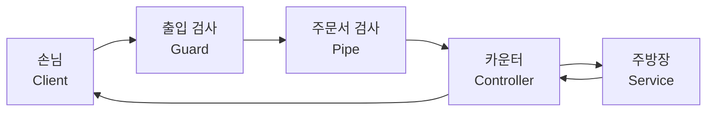

# 치킨집 관리 서버 (Day 3 NestJS 스터디)

저번 주(`day-2-nestjs`)에 만든 치킨집 CRUD 서버에 **요청을 안전하게 처리하는 기능**을 붙였습니다.

이번 주 다룬 것: **DTO + Validation · Pipe · Exception · Guard · Test**

> 원문: [3. NestJS (2) — skkuding/cookbook](https://github.com/skkuding/cookbook/blob/main/content/docs/backend/3.%20NestJS%20(2).md)

## 실행하기

```bash
pnpm install
pnpm run start:dev   # http://localhost:3000
```

테스트:

```bash
pnpm test         # Unit Test (chicken.service.spec.ts)
pnpm run test:e2e # E2E Test (test/chicken.e2e-spec.ts)
pnpm run test:cov # 커버리지 포함
```

> Node 24.9 이상이 필요합니다. 스크립트가 `NODE_OPTIONS=--experimental-vm-modules`를
> 넣어 주는 이유는, NestJS 12 패키지가 ESM(`"type": "module"`)으로 배포되어
> Jest가 이를 `require`로 읽기 위해 experimental VM Modules가 필요하기 때문입니다.
> `cross-env`를 쓴 이유도 Windows에서 `NODE_OPTIONS=...` 문법이 먹지 않기 때문입니다.

## 요청이 들어오면 무슨 일이 일어나나요?



저번 주에는 `손님 → 카운터 → 주방장`이었는데, 이번 주에는
**카운터 앞에 두 명(Guard, Pipe)이 더 배치**되었습니다.

| 단계 | 담당 | 구현 파일 | 막는 것 |
| --- | --- | --- | --- |
| 출입 검사 | `ApiKeyGuard` | `src/chicken/guards/api-key.guard.ts` | 직원이 아닌 사람의 변경 요청 |
| 주문서 검사 | `ValidationPipe` + `ParseIntPipe` | `src/app.setup.ts`, `chicken.controller.ts` | 양식에 안 맞는 Body, 숫자가 아닌 id |
| 재고 확인 | Built-in Exception | `src/chicken/chicken.service.ts` | 없는 가게(404), 중복 상호(409) |

각 단계가 **다른 문제**를 검사하기 때문에 서로 다른 곳에서 처리합니다.

- Pipe: *요청 데이터 자체*가 유효한가? (형식, 타입, 숫자 변환)
- Service: *실제 데이터*가 존재하는가? (장부에 있는가)

## API

변경 API(POST/PATCH/DELETE)는 반드시 `x-api-key: chicken-admin-key` 헤더가 필요합니다.

| 메서드 | 경로 | 설명 | Guard | 응답 |
| --- | --- | --- | --- | --- |
| GET | `/chicken` | 전체 치킨집 목록 | - | 200 |
| GET | `/chicken/:id` | 치킨집 단건 조회 | - | 200 / 400 / 404 |
| POST | `/chicken` | 치킨집 등록 | ✅ | 201 / 400 / 403 / 409 |
| PATCH | `/chicken/:id` | 치킨집 정보 일부 수정 | ✅ | 200 / 400 / 403 / 404 |
| DELETE | `/chicken/:id` | 치킨집 삭제 | ✅ | 200 / 400 / 403 / 404 |

`id`는 손님이 정하지 않습니다. 등록하면 서버가 자동으로 붙여 줍니다.

### 상태코드 정리

| 상태코드 | 언제 | 누가 |
| --- | --- | --- |
| 400 | Body가 DTO 규칙에 안 맞거나, id가 숫자가 아님 | ValidationPipe / ParseIntPipe |
| 401 | (아직 안 씀) 인증 실패 — `UnauthorizedException` | - |
| 403 | API Key가 없거나 틀림 | ApiKeyGuard |
| 404 | 없는 id로 조회·수정·삭제 | ChickenService |
| 409 | 같은 상호가 이미 등록됨 | ChickenService |

## 이번 주 새로 배운 것

### 1. DTO에 검사 규칙을 붙이다

`src/chicken/dto/create-chicken.dto.ts`

```ts
export class CreateChickenDto {
  @IsString()
  @IsNotEmpty()
  name: string;

  @IsEnum(ChickenType) // 메뉴판에 없는 메뉴("SPICY")는 여기서 막힘
  type: ChickenType;

  @IsInt()
  @Min(0)
  price: number;
  // ...
}
```

DTO만 만들어서는 아무도 검사하지 않습니다. **규칙을 적어 놓고**
실제 요청에 적용할 무언가가 필요합니다.

### 2. ValidationPipe로 규칙을 실제 요청에 적용

`src/app.setup.ts`

```ts
app.useGlobalPipes(new ValidationPipe({ whitelist: true, transform: true }));
```

- `whitelist: true` → DTO에 없는 필드는 조용히 잘라냅니다.
  손님이 `id`, `isAdmin`을 끼워 넣어도 주방장에게 전달되지 않습니다.
- `transform: true` → 요청 값을 DTO에 선언된 타입으로 변환합니다.

`main.ts`와 e2e 테스트가 `setupApp()`을 함께 쓰는 이유는,
테스트가 진짜 서버와 **완전히 같은 설정**으로 돌아야 하기 때문입니다.

### 3. ParseIntPipe로 숫자 변환

```ts
@Get(':id')
findOne(@Param('id', ParseIntPipe) id: number) {
  return this.chickenService.findById(id);
}
```

URL로 들어오는 값은 항상 문자열입니다. `ParseIntPipe`가 숫자로 바꿔 주고,
`/chicken/chicken`처럼 바꿀 수 없으면 컨트롤러에 도달하기 전에 400으로 막습니다.

### 4. Built-in Exception으로 문제를 알리기

```ts
findById(id: number): Chicken {
  const chicken = this.readData().find((item) => item.id === id);
  if (!chicken) {
    throw new NotFoundException('해당 치킨집 정보가 존재하지 않습니다.');
  }
  return chicken;
}
```

| Exception | 상태코드 | 언제 쓰나 |
| --- | --- | --- |
| `BadRequestException` | 400 | 요청 데이터가 잘못됨 |
| `UnauthorizedException` | 401 | 신원을 확인하지 못함 |
| `ForbiddenException` | 403 | 신원은 알지만 권한이 없음 |
| `NotFoundException` | 404 | 찾는 데이터가 없음 |
| `ConflictException` | 409 | 현재 상태와 충돌함 |

### 5. Guard로 접근 제어

`src/chicken/guards/api-key.guard.ts`

```ts
canActivate(context: ExecutionContext): boolean {
  const request = context.switchToHttp().getRequest();
  return request.headers['x-api-key'] === API_KEY;
}
```

`true`면 통과, `false`면 NestJS가 거절합니다.

Guard는 "**허용할지 거부할지**"만 결정합니다.
"이 사람이 누구인가"(Authentication)와 "무엇을 할 수 있는가"(Authorization)는
실제 프로젝트에서 로그인·권한 시스템으로 확장하는 주제입니다.

> ⚠️ `false`를 반환하면 NestJS는 403을 보냅니다. 그런데 API Key가 없다는 것은
> 본질적으로 "신원을 확인하지 못했다"이므로 401이 더 정확합니다.
> 스터디는 본문 코드를 그대로 따랐지만, 실제 프로젝트에서는
> `throw new UnauthorizedException()`으로 바꾸는 편이 좋습니다.

### 6. 테스트

| 종류 | 무��을 테스트 | 이 프로젝트의 파일 |
| --- | --- | --- |
| Unit Test | 주방장 한 명을 독립적으로 | `src/chicken/chicken.service.spec.ts` |
| Integration Test | 카운터와 주방이 함께 | (지금은 e2e가 함께 검증) |
| E2E Test | 손님 요청부터 응답까지 전체 | `test/chicken.e2e-spec.ts` |

```ts
const module = await Test.createTestingModule({
  providers: [ChickenService],
}).compile();

service = module.get<ChickenService>(ChickenService);
```

Unit Test는 HTTP 없이 주방장만 띄웁니다. e2e는 `supertest`로 진짜 요청을 보내고
Guard(403)·Pipe(400)·Exception(404/409)이 각각 제 역할을 하는지 확인합니다.

> 주방장은 `src/data/chickens.json`을 직접 읽고 씁니다.
> 테스트가 원본 장부를 덮어쓰지 않도록 **테스트마다 임시 파일**로 경로를 바꿉니다.

## API 테스트 (Bruno)

`bruno/chicken-api/`에 요청 모음이 있습니다.

1. [Bruno](https://www.usebruno.com/) 설치
2. `pnpm run start:dev`로 서버를 켭니다
3. Bruno에서 `chicken-api` 컬렉션을 열고 `local` 환경을 선택합니다
4. 요청을 하나씩 실행하면서 **기대 상태코드**와 compare해 봅니다

`05-에러 케이스` 폴더가 이번 주의 핵심입니다.
**일부러 잘못된 요청을 보내서** 각 직원이 어디서 막는지 확인해 보세요.

수정 요청이 전부 403으로 막히는다면 헤더의 `x-api-key` 값을
`{{apiKey}}`로 지정했는지 확인하세요.

## 더 해보면 좋을 것

- [ ] `forbidNonWhitelisted: true`로 바꿔 보고, 잘라내기와 거절의 차이 비교
- [ ] API Key를 환경변수(`process.env.API_KEY`)로 옮기기
- [ ] `UnauthorizedException`으로 바꿔 보고 401 응답 확인
- [ ] `LoggerMiddleware`(모든 요청 로그) 구현해 보기
- [ ] `TransformInterceptor`(응답 시간을 로그로 남기기) 구현해 보기
- [ ] `HttpExceptionFilter`로 404 응답 형식 통일해 보기
- [ ] `@CurrentUser()` 커스텀 데코레이터 만들기

이 중 Middleware, Interceptor, Exception Filter, Custom Decorator는
**이번 실습에서 다루지 않았지만** 요청 흐름에서 어떤 자리를 차지하는지
공식 문서로 확인해 보세요.
